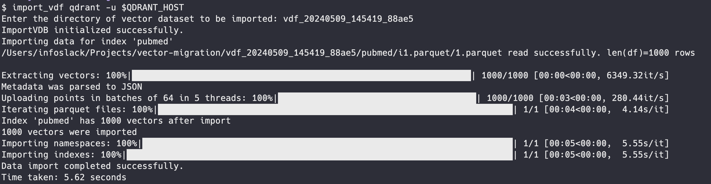

# Tutorial (draft)
You started a project involving RAG using another vector database and are now considering migrating to Qdrant to benefit from open source and the possibility of having total control and privacy of your data with the hybrid cloud solution.

This tutorial will show a tool that helps you migrate your data uncomplicatedly. Vector-io is a library that makes it easy to migrate, transform, and manage your vector data across different vector databases using a standard format called Vector Dataset Format (VDF).

The library uses VDF to standardize the vector data storage, ensuring the data structure is consistent regardless of the destination database. This format includes a JSON file that details metadata about the vectors (such as dimensions, the embedding model used, and the source database) and, of course, Parquet files to store the vector data and associated metadata.

Let's look at a practical example: migrating data from Pinecone to Qdrant. In this example, we have a Pinecone index that contains several data from a PubMed dataset. These vectors were generated using the 1536-dimensional OpenAI "text-embedding-3-small" embedding model.


At this point, we just want to migrate the data without making any extra changes. First, we need to import the library:

```bash
pip install vdf-io
```

Once installed, the next step is to export the Pinecone index:

```bash
export_vdf pinecone --serverless \
  --cloud $PINECONE_CLOUD \
  --region $PINECONE_REGION \
  --index pubmed \
  --namespace ""
```


Now that the export has been done successfully, let's create a new Qdrant collection by importing the data. At this point, you are asked for the directory with the files that were obtained in the export process:

```bash
import_vdf qdrant -u $QDRANT_HOST
```



Note that the data was imported maintaining the same dimension:

